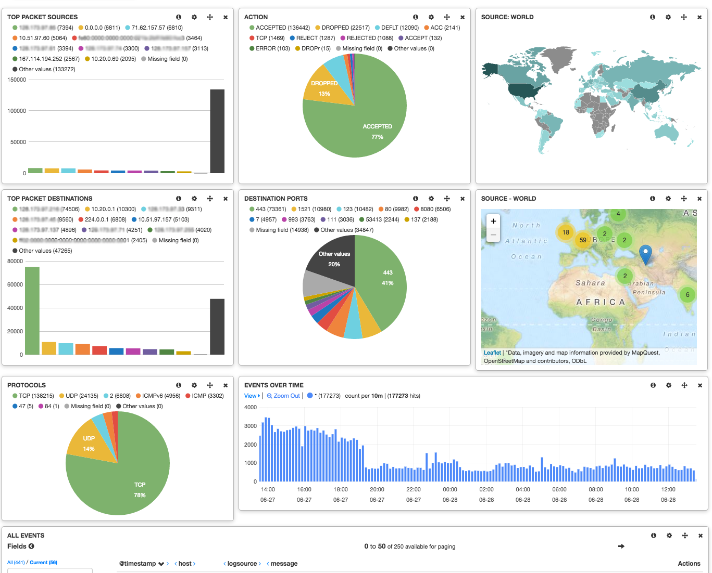

# nagioslogserver-netfilter

## Sample dashboard



## Installation

This guide assumes your netfilter logs are being already ingested by Nagios Log Server, and have some of these fields:
```
[19333126.907670] SFW2-INext-ACC IN=eth0 OUT= MAC=a4:ba:db:0c:22:57:00:1b:2b:90:fc:c3:08:00 SRC=1.2.3.4 DST=3.2.4.1 LEN=60 TOS=0x00 PREC=0x00 TTL=63 ID=52253 DF PROTO=TCP SPT=56288 DPT=5666 WINDOW=29200 RES=0x00 SYN URGP=0 OPT (020405B40402080A65D439FA0000000001030307)
```

* Create new filter with the content of [50-netfilter.conf](logstash.d/50-netfilter.conf)
* Create new dashboard with the content of [netfilter_dashboard.json](dashboards/netfilter_dashboard.json)

### Optional components

* Install `logstash-filter-cidr` plugin:
```
/usr/local/nagioslogserver/logstash/bin/plugin install logstash-filter-cidr
```
* Install geoip packages

** CentOS 6.x (used by nagios log server VM)
```
yum install GeoIP GeoIP-GeoLite-data GeoIP-GeoLite-data-extra
```

** CentOS 7.x
```
yum install GeoIP GeoIP-update
```

## How it works

Basic logstash filter first tries to extract relevant data from netfilter messages, then uses geoip function to add location data. Optionally `cidr` function from `logstash-filter-cidr` plugin can be used to add tags when a given source and/or destination match specific network ranges. We use it to tag our networks, and then filters & queries can be easily written to match those networks.

Example query:
```
("nf_SRC_net_mynet1" OR "nf_SRC_mynet2)
```


## Testing & Troubleshooting

Nagios Log Server has logstash configured to log to `/var/log/logstash/logstash.log`.

### Testing from CLI

Using command line:

* run logstash from CLI
```
/usr/local/nagioslogserver/logstash/bin/logstash --config logstash.d/
```

* paste sample log message
```
[19333126.907670] SFW2-INext-ACC IN=eth0 OUT= MAC=a4:ba:db:0c:22:57:00:1b:2b:90:fc:c3:08:00 SRC=1.2.3.4 DST=3.2.4.1 LEN=60 TOS=0x00 PREC=0x00 TTL=63 ID=52253 DF PROTO=TCP SPT=56288 DPT=5666 WINDOW=29200 RES=0x00 SYN URGP=0 OPT (020405B40402080A65D439FA0000000001030307)
```

* sample output
```
{
         "message" => "IN=eth0 OUT= MAC=a4:ba:db:0c:22:57:00:1b:2b:90:fc:c3:08:00 SRC=1.2.3.4 DST=3.2.4.1 LEN=60 TOS=0x00 PREC=0x00 TTL=63 ID=52253 DF PROTO=TCP SPT=56288 DPT=5666 WINDOW=29200 RES=0x00 SYN URGP=0",
        "@version" => "1",
      "@timestamp" => "2016-06-28T17:15:31.761Z",
            "host" => "nibbler.local",
         "program" => "kernel",
          "nf_opt" => "020405B40402080A65D439FA0000000001030307",
    "nf_TIMESTAMP" => "[19333126.907670]",
       "nf_ACTION" => "ACC",
           "nf_IN" => "eth0",
          "nf_SRC" => "1.2.3.4",
          "nf_DST" => "3.2.4.1",
          "nf_LEN" => "60",
          "nf_TOS" => "0x00",
         "nf_PREC" => "0x00",
          "nf_TTL" => "63",
           "nf_ID" => "52253",
        "nf_PROTO" => "TCP",
          "nf_SPT" => "56288",
          "nf_DPT" => "5666",
       "nf_WINDOW" => "29200",
          "nf_RES" => "0x00",
         "nf_URGP" => "0",
           "geoip" => {
                    "ip" => "1.2.3.4",
         "country_code2" => "AU",
         "country_code3" => "AUS",
          "country_name" => "Australia",
        "continent_code" => "OC",
              "latitude" => -27.0,
             "longitude" => 133.0,
              "location" => [
            [0] 133.0,
            [1] -27.0
        ]
    },
            "type" => "netfilter_log"
}
```
